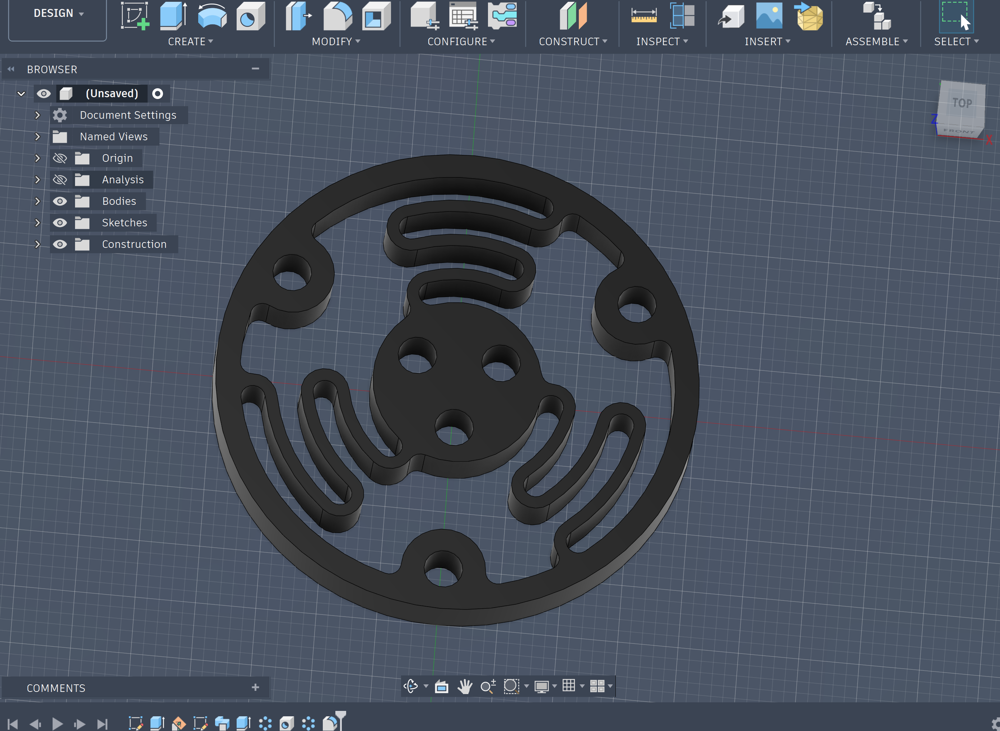
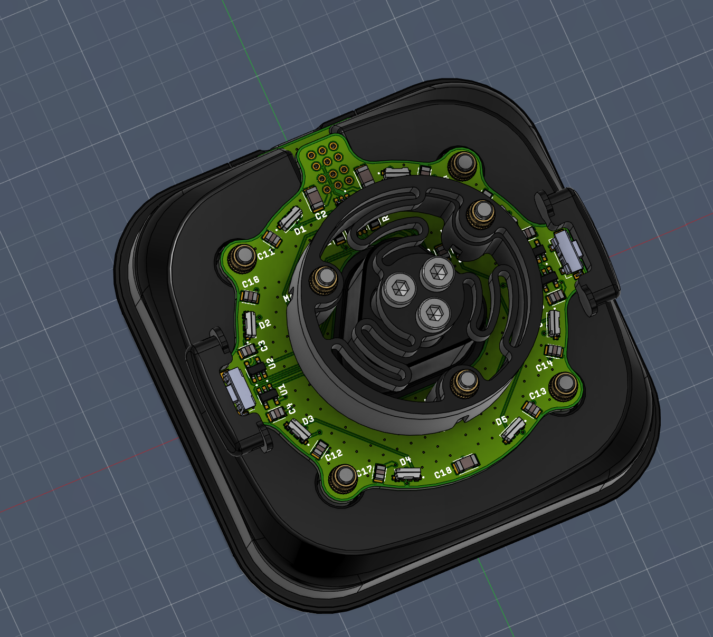
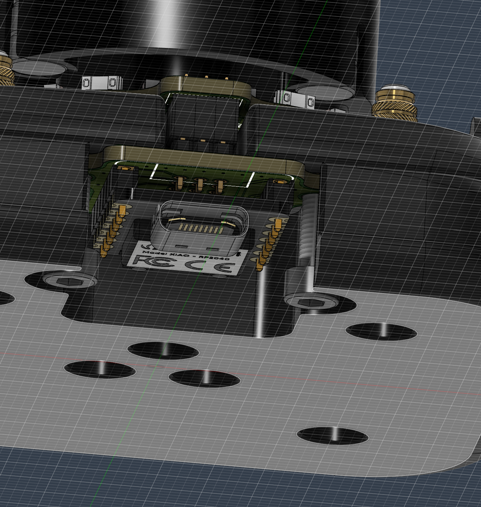
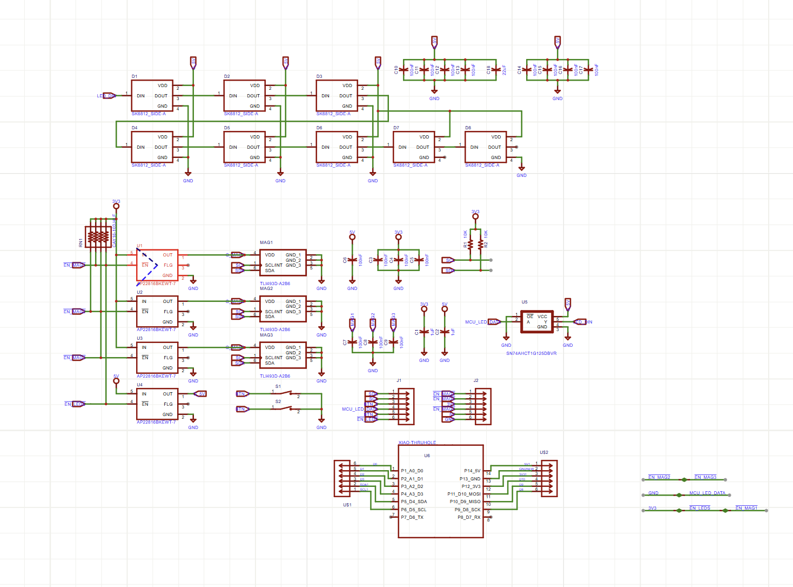
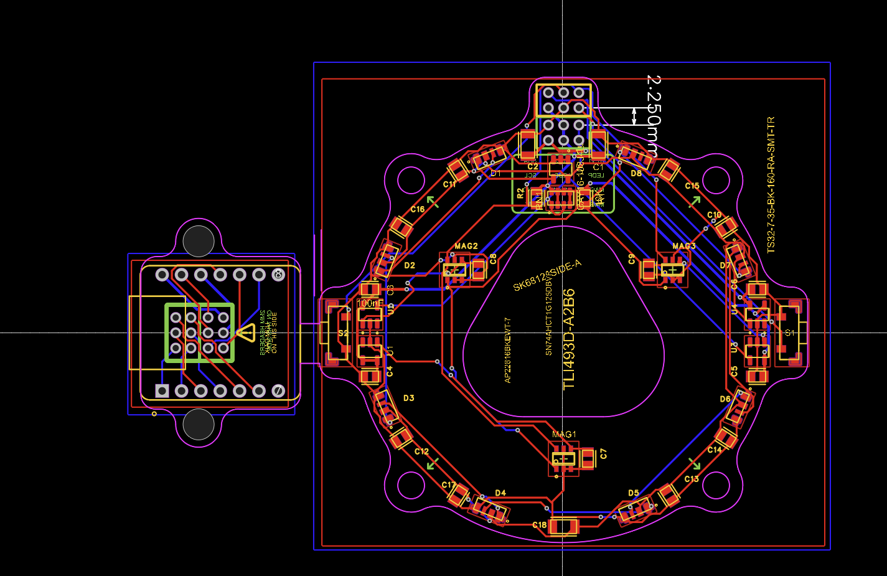

  

# DIY_Space_Mouse

A simple, affordable, and open-source 3D mouse. Designed to make 3D navigation accessible to everyone without the premium price tag.

## 3D Printing

Every structural part of this mouse is 3D printable. I used standard PLA with default settings, and it works great. You can pick any color that fits your desk setup.

* **Material:** PLA (or PETG if you prefer).
* **Settings:** Default/Standard settings are fine.
* **Optional:** If you want the LEDs to look a bit more polished, print the diffuser in clear PLA. If you aren't a fan of the lighting, you can just leave that part out entirely.

## Assembly Guide

Putting the mouse together is quite simple. You will just need a few pieces of hardware to get started.

### Hardware Needed
* **Heat-Set Inserts:** 16 x M3 x 4mm
* **M3 Screws:** 10 x 16mm and 5 x 12mm
* **M2 Screws:** 1 x 4mm
* **Magnets:** 6 x (6mm x 3mm)

### Steps to Assemble
1. **The Spring:** The top part of the mouse screws directly into the spring. The spring is parametric, so if the movement doesn't feel quite right to you, you can adjust the files and re-print it.
   

2. **Magnets:** Seat the magnets into the top housing. These are essential for the sensors to track movement.
3. **The Base:** Place the PCB into the bottom part of the housing. It is secured with screws from the bottom.
   

4. **The Brain:** Plug the XIAO RP2040 into the stacked PCB. Make sure everything is seated firmly.
   

5. **Closing up:** Screw the bottom plate on from the underside. If you’re using the clear diffuser, make sure it’s in place before you close everything up.

---

## The PCB

The electronics are based on the XIAO RP2040. While you can have this board professionally assembled by a service like JLCPCB, I’m planning to assemble my own using a hot plate (or heat gun) and some solder paste.

### Design & Schematics
* **Schematic:**
  

* **Board Layout:**
  

---

## Firmware

The firmware is currently untested. The goal is for the device to spoof the hardware ID of a 3Dconnexion device so it works seamlessly with their existing software. It uses the same HID protocols as any other 3d mouse, found from google.

* **Tools:** Everything was written in VS Code.
* **How to Upload:** Use PlatformIO to flash the firmware onto the XIAO RP2040.

Simply plug in your device, open the project in VS Code, and use the PlatformIO "Upload" button to get it running.

---

